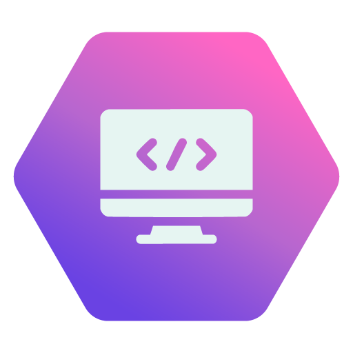

<h1 align="center">HIVE.CONNECT</h1>
<div align="center">
  
</div>


## Objetivo

    O objetivo desta trilha é te capacitar para atuar no desenvolvimento de software, abrangendo tanto a parte visual (Frontend) quanto a lógica por trás das aplicações (Backend).

## Perfil de um Profissional de Programação
    Quem trabalha com programação precisa ser lógico, criativo e ter boa capacidade de resolução de problemas. A habilidade de aprender novas tecnologias rapidamente e trabalhar em equipe também são essenciais.

    Principais Características:

- **Pensamento Lógico:** Essencial para estruturar algoritmos e resolver problemas.
- **Criatividade:** Importante para desenvolver interfaces e soluções inovadoras.
- **Resiliência:** Lidar com erros e desafios durante o desenvolvimento.
- **Atenção aos Detalhes:** Erros pequenos podem causar grandes problemas.
- **Capacidade de Aprendizado:** O campo da tecnologia está sempre evoluindo.
- **Trabalho em Equipe:** Muitos projetos são desenvolvidos colaborativamente.

## Habilidades Técnicas Importantes:

### Frontend
→ **HTML:** Estrutura da página web.
→ **CSS:** Estilização visual da página.
→ **JavaScript:** Interatividade e dinamismo no navegador.
→ **Frameworks/Bibliotecas:** React, Angular, Vue.js (para interfaces complexas).
→ **Gerenciamento de Estado:** Redux, Zustand, Context API.
→ **Testes:** Jest, React Testing Library.
→ **Responsividade:** Design adaptável a diferentes dispositivos.
→ **Controle de Versão:** Git.

### Backend
→ **Linguagens de Programação:** Python, JavaScript (Node.js), Java, C#, Go, Ruby, PHP.
→ **Frameworks:** Django, Flask (Python), Express.js (Node.js), Spring (Java), .NET (C#), Ruby on Rails (Ruby), Laravel (PHP).
→ **Bancos de Dados:** SQL (MySQL, PostgreSQL, SQL Server), NoSQL (MongoDB, Cassandra).
→ **APIs:** RESTful, GraphQL.
→ **Autenticação e Autorização:** JWT, OAuth.
→ **Servidores:** Linux, Nginx, Apache.
→ **Cloud:** AWS, Azure, GCP.
→ **Testes:** Unitários, de integração.
→ **Controle de Versão:** Git.

## Áreas principais:
- Desenvolvedor Frontend
- Desenvolvedor Backend
- Desenvolvedor Fullstack
- Engenheiro de Software
- Arquiteto de Software
- Desenvolvedor Mobile (React Native, Flutter - embora não estritamente Frontend/Backend, usam essas habilidades)

## Título para LinkedIn:

Desenvolvedor Frontend | React | JavaScript | HTML | CSS | Experiência em [Framework/Biblioteca]
<br>
Desenvolvedor Backend | Python | Django/Flask | APIs REST | Bancos de Dados SQL/NoSQL | Experiência em [Linguagem/Framework]
<br>
Desenvolvedor Fullstack | JavaScript | React/Node.js | Python | Django/Flask | Experiência em [Tecnologias]
<br>
Engenheiro de Software | [Linguagens/Frameworks] | Arquitetura de Sistemas | Cloud | DevOps

- **Esses são apenas alguns exemplos. Você pode criar o seu título personalizado destacando as tecnologias e áreas em que você tem mais experiência ou interesse.**

---
## Links Importantes para Programação

| Categoria | Nome | Descrição | Link |
| :---: | :---: | :---: | :---: |
| **Documentação** | MDN Web Docs | Documentação abrangente sobre tecnologias web (HTML, CSS, JavaScript) | [MDN Web Docs](https://developer.mozilla.org/pt-BR/) |
| **Documentação** | Documentação Oficial [Linguagem/Framework] | Consulte a documentação oficial da sua linguagem ou framework preferido | [Link da Documentação Oficial] |
| **Aprendizado Interativo** | freeCodeCamp | Plataforma com cursos gratuitos e projetos práticos de desenvolvimento web e outras áreas | [freeCodeCamp](https://www.freecodecamp.org/) |
| **Aprendizado Interativo** | Codecademy | Cursos interativos para aprender diversas linguagens de programação e tecnologias | [Codecademy](https://www.codecademy.com/) |
| **Comunidade** | Stack Overflow | Fórum de perguntas e respostas para programadores | [Stack Overflow](https://stackoverflow.com/) |
| **Comunidade** | GitHub | Plataforma de hospedagem de código para colaboração e controle de versão | [GitHub](https://github.com/) |
| **Notícias/Artigos** | [Nome de um Blog de Programação relevante em Português] | Artigos e tutoriais sobre desenvolvimento | [Link do Blog] |
| **Notícias/Artigos** | [Nome de outro Blog de Programação relevante em Português] | Mais recursos e informações sobre programação | [Link do Outro Blog] |

---
## O que você verá em cada módulo:</h1>
<h1 align="center">Frontend</h1>

```mermaid
  graph LR;
    A[Frontend] --> B[HTML Essencial];
    A --> C[CSS Fundamentos];
    A --> D[JavaScript Básico];
    B --> E[HTML Semântico];
    C --> F[Layout com CSS (Flexbox & Grid)];
    D --> G[DOM e Manipulação];
    E --> H[Acessibilidade Web];
    F --> I[CSS Avançado (Animações, Transições)];
    G --> J[ES6+];
    H --> K[Otimização de Frontend];
    I --> L[Frameworks Frontend (React, Angular, Vue.js - Introdução)];
    J --> M[Gerenciamento de Estado (Conceitos)];
    K --> N[Testes em Frontend (Conceitos)];
    L --> O[Construção de Interfaces Complexas];
    M --> P[Gerenciamento de Estado (Prática)];
    N --> Q[Testes em Frontend (Prática)];

    click A "[https://github.com/socialhiveconnect/Programacao/tree/main/frontend](https://github.com/socialhiveconnect/Programacao/tree/main/frontend)" "Veja o repositório de Frontend"
```

&lt;h1 align="center">Backend&lt;/h1>
```mermaid
   graph LR;
    A[Backend] --> B[Lógica de Programação (Revisão)];
    A --> C[Escolha de Linguagem Backend ([Exemplo: Python, Node.js, Java])];
    A --> D[Framework Backend ([Exemplo: Django/Flask, Express.js, Spring]) - Introdução];
    B --> E[Estruturas de Dados e Algoritmos];
    C --> F[Sintaxe e Fundamentos da Linguagem];
    D --> G[Rotas e Controladores];
    E --> H[Bancos de Dados (SQL/NoSQL) - Conceitos];
    F --> I[APIs RESTful];
    G --> J[Middleware e Segurança];
    H --> K[Modelos e ORM/ODM];
    I --> L[Autenticação e Autorização];
    J --> M[Testes no Backend];
    K --> N[Consultas e Otimização de Banco de Dados];
    L --> O[Implantação (Conceitos Básicos)];
    M --> P[Framework Backend ([Exemplo: Django/Flask, Express.js, Spring]) - Avançado];
    N --> Q[Escalabilidade e Performance];
    O --> R[Implantação (Prática)];

    click A "[https://github.com/socialhiveconnect/Programacao/tree/main/backend](https://github.com/socialhiveconnect/Programacao/tree/main/backend)" "Veja o repositório de Backend"
 ```
   
**Vamos juntos fortalecer o conhecimento, Hive.Connect uma comunidade de todos, para todos!**  
